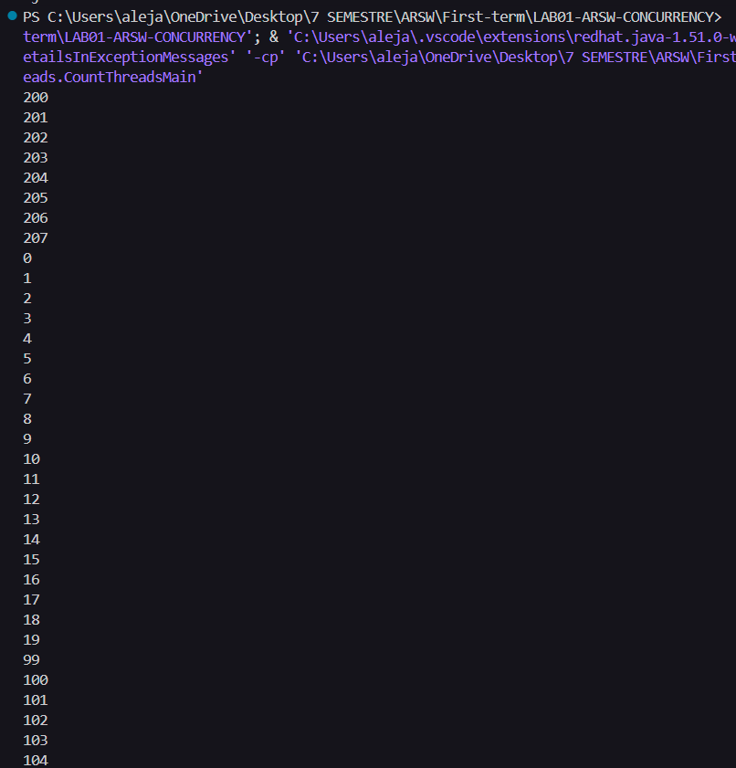
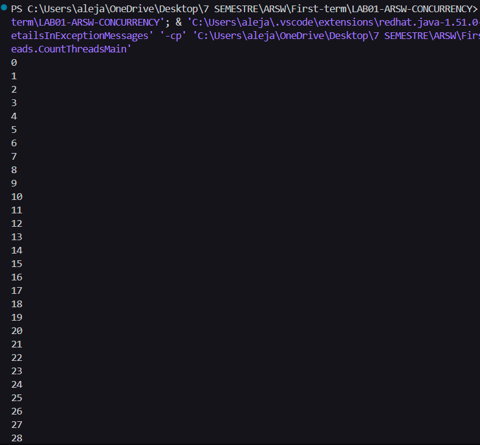

Laboratorio ARWS (ARQUITECTURA DE SOFTWARE)

-David Alejandro Patacon Henao
-Daniel Felipe Hueso Rueda

Punto 1 

Se nos pide crear 3 hilos que cuenten cada uno en un rango diferente, el primer hilo debe contar de 0 a 99, el segundo de 100 a 199 y el tercero de 200 a 299.

despues se inician los hilos usando el metodo start y luego se inicia la ejecucion de los hilos usando el metodo run.

Al revisar las salidas de ambos metodos se puede observar que al usar start los hilos se ejecutan de manera concurrente, es decir, los tres hilos cuentan al mismo tiempo y la salida es intercalada. En cambio, al usar run, los hilos se ejecutan de manera secuencial, es decir, un hilo termina su ejecucion antes de que el siguiente comience, lo que resulta en una salida ordenada y no intercalada.

Ejemplo de salida al usar start:  

Ejecucion de los hilos con run:  

